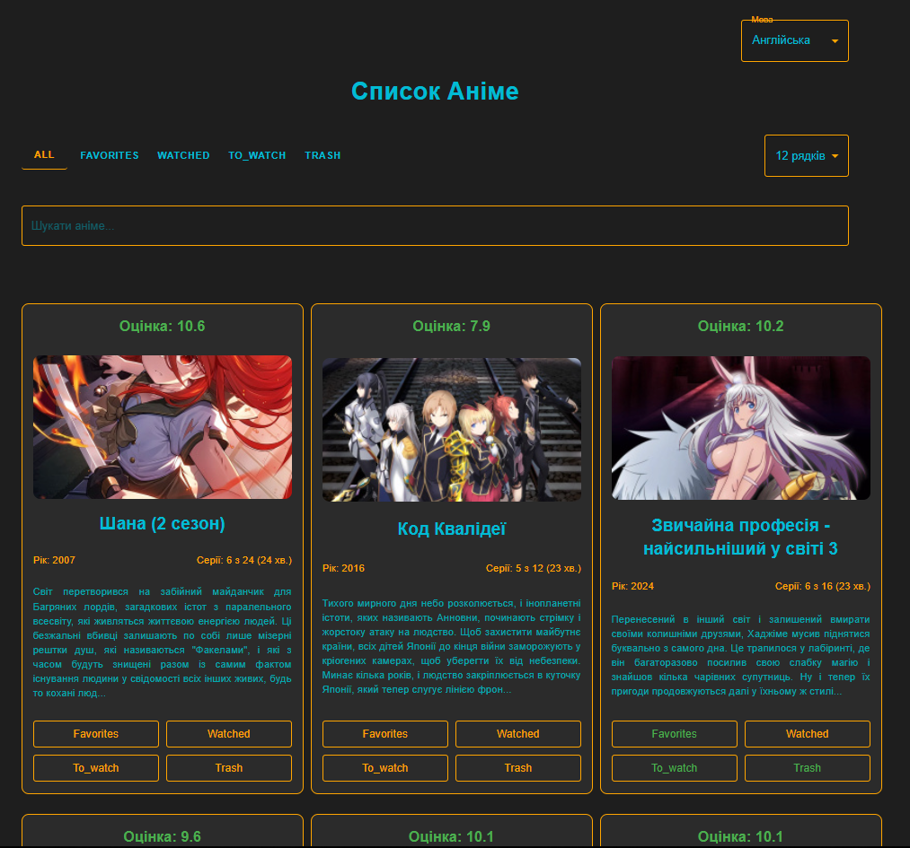
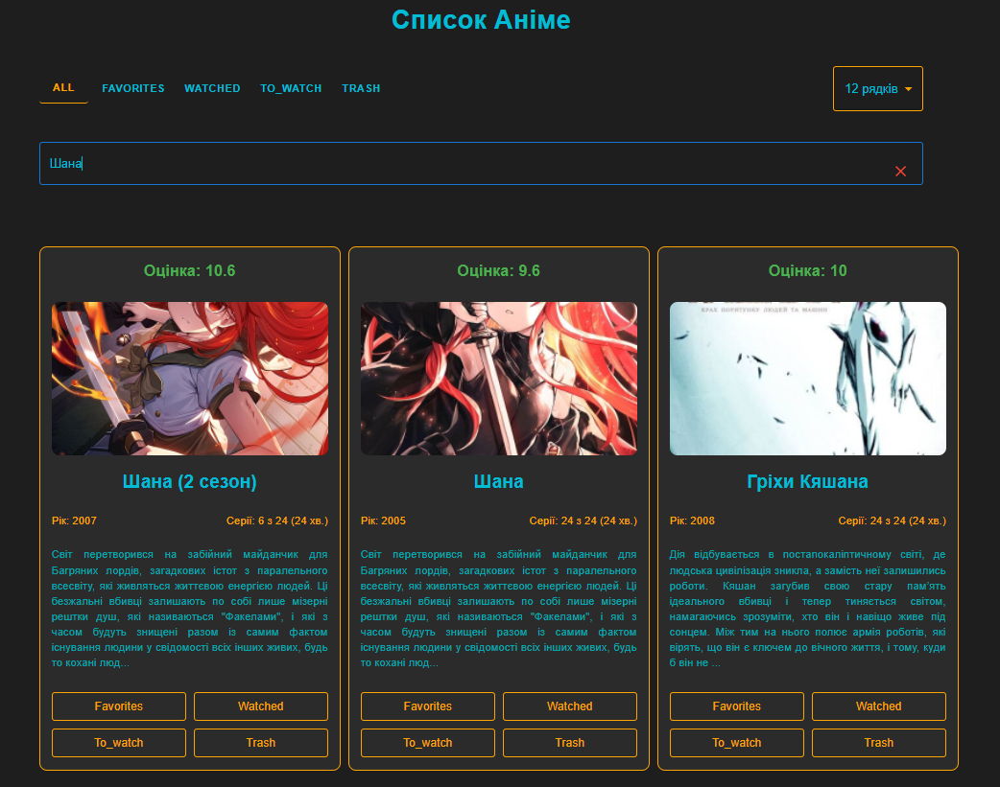
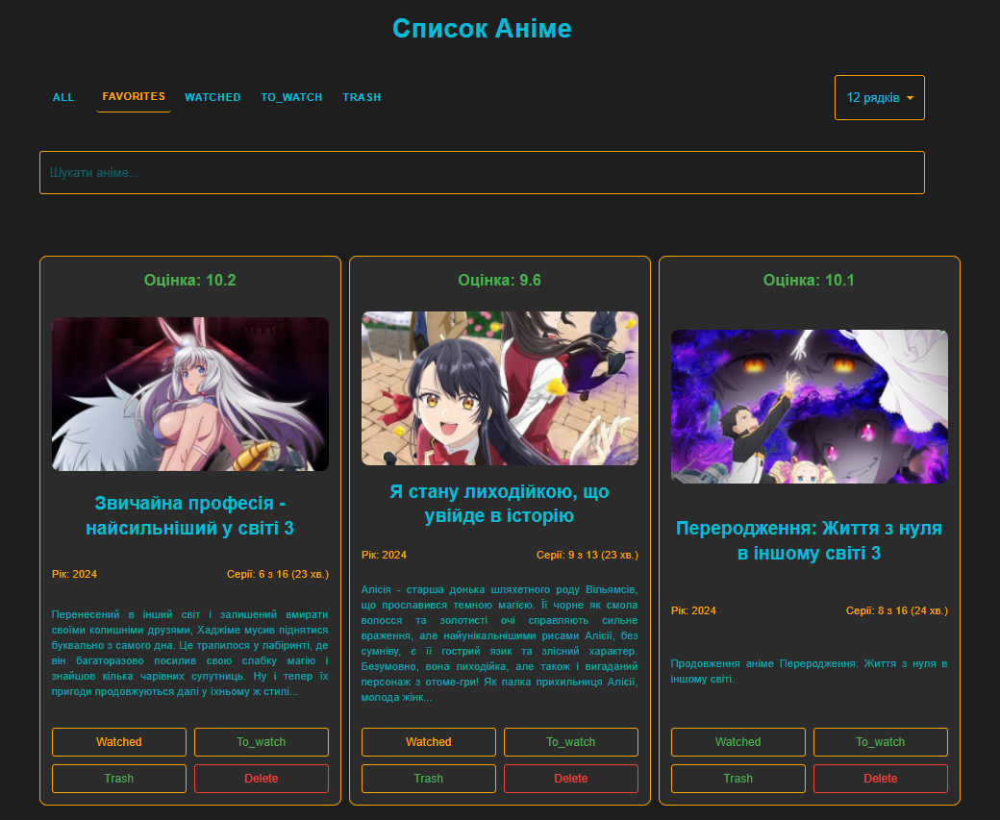

# Anime List Project 🎥📚

Welcome to the **Anime List** project! 🎉 This is a simple web application for browsing, searching, and categorizing anime. You can manage anime by assigning them to categories like **favorites**, **watched**, **to watch**, etc. The app allows you to filter and search anime based on various criteria.

## Features ✨

- **Anime Search** 🔍: Easily search anime by title or year.
- **Category Management** 📋: Organize your anime into different categories like favorites, watched, to watch, etc.
- **Pagination** 📄: Browse through long lists of anime using pagination.
- **Language Support** 🌍: Toggle between English and Ukrainian languages (though the translation still needs some work).
- **Responsive Design** 📱: Works great on both desktop and mobile devices.

## Backend Details 💻

This project uses **Flask** for the backend. Here's what the backend provides:

### API Endpoints 📡

- **GET /api/anime**: Fetch all anime data.
- **POST /api/categories**: Update the categories of a specific anime.
- **POST /api/delete_category**: Delete a category from a specific anime.
- **GET /api/proxy_image**: Proxy and cache anime images to avoid issues with image fetching.

The app also includes a **scraper** written in Python that fetches anime information from an external site.

### Scraper Features 📜

- **Scraping Anime Data**: The scraper collects anime data, including titles, image URLs, categories, ratings, voice actors, and more from a third-party website.

- **Saving Data**: The scraped anime data is stored in a `anime_data.json` file, which the app uses to display the anime list.

## Screenshots 📸

  

*Main screen displaying anime list*

  

*Search feature in action*

  

*Category management interface*

## Installation 🛠️

To get started, clone this repository and follow the steps below:

### Frontend (React)

1. **Clone the repository**:
   ```bash
   git clone https://github.com/Antot-12/The-Greatest-Anime-Viewer-App.git
  
   cd anime-list
   ```

2. **Install dependencies**:
   ```bash
   npm install
   ```

3. **Start the app**:
   ```bash
   npm start
   ```

Your app should now be running on `http://localhost:3000/all`.

### Backend (Flask)

1. **Install dependencies**:
   Ensure you have Python 3.x installed and then run:
   ```bash
   pip install flask flask-cors flask-caching requests beautifulsoup4
   ```

2. **Run the Flask server**:
   ```bash
   python app.py
   ```

The Flask API will be running on `http://localhost:5000`.

## Technologies Used 💻

- **Python** 🐍📜💻 (for backend and web scraping)
- **Flask** 🍶 (backend web framework)
- **React** ⚛️ (frontend)
- **Material-UI** 🎨 (for UI components)
- **Axios** 🔌 (for HTTP requests)
- **Node.js** 🟩 (for running the React app)

## Work in Progress 🚧

- **Translation** 🌍: The translation feature still needs some work, particularly in the Ukrainian version. Some text might be missing or incorrect. Feel free to help improve the translations! 💬
- **Deleting Anime** ❌: The delete functionality is currently broken. When trying to delete anime, it doesn't work as expected, and the data isn't saved correctly. We plan to fix this soon! 🛠️
- **API Error Handling** 🚨: Some error handling (especially around the anime categories) could be more robust. We're working on improving this! ⚙️
